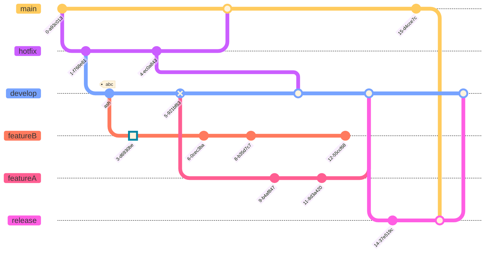

# Review

The Bobiverse series is a set of ~~three~~ four science fiction books written by author Dennis E. Taylor. This series is a blend of science, humor, and drama that takes the reader on a thrilling journey through space and time.

The story begins with Bob Johansson, a software engineer who, after being cryogenically frozen, wakes up to find that he has been uploaded into a machine that allows him to travel through the universe. Bob, now a sentient being, embarks on a journey to explore the vast reaches of space and to experience life in new and unique ways.

Throughout the series, Bob faces many challenges as he travels from one planet to the next, including encounters with alien civilizations, time-travel paradoxes, and threats to his existence. However, he never loses his sense of humor and his ability to find the humor in even the most dire of situations.

One of the standout features of the Bobiverse series is its depiction of artificial intelligence. Through Bob's experiences, the reader is introduced to a range of AI beings, from those who are fully self-aware to those who are still in their developmental stages. This allows for a deeper exploration of the concept of consciousness and the implications of AI on society.

Another great aspect of the series is its imaginative world-building. The author has created a vast and detailed universe, filled with diverse cultures, technologies, and landscapes that are as fascinating as they are believable. The Bobiverse series is a testament to the power of imagination and the limitless potential of science fiction.

In conclusion, the Bobiverse series is a must-read for anyone who loves science fiction, humor, and adventure. With its unique blend of humor and science, this series is sure to keep you entertained and captivated from start to finish. Whether you are a long-time fan of science fiction or are just looking for something new and exciting to read, the Bobiverse series is an excellent choice that is sure to satisfy.

# Bobiverse

----|----
--: | :--
Book | Project Hail Mary
Auther | Andy Weir
Year | 2021
My Rating | ⭐⭐⭐⭐

[Insert Review]

[Originally posted on Goodreads](https://www.goodreads.com/review/show/4039914166)

<a href="https://www.goodreads.com/book/show/54493401-project-hail-mary">Project Hail Mary</a> by <a href="https://www.goodreads.com/author/show/6540057.Andy_Weir">Andy Weir</a> 
My rating: <a href="https://www.goodreads.com/review/show/4039914166">5 of 5 stars</a>  

  
<a href="https://www.goodreads.com/review/list/38832432-nick">View all my reviews</a>
